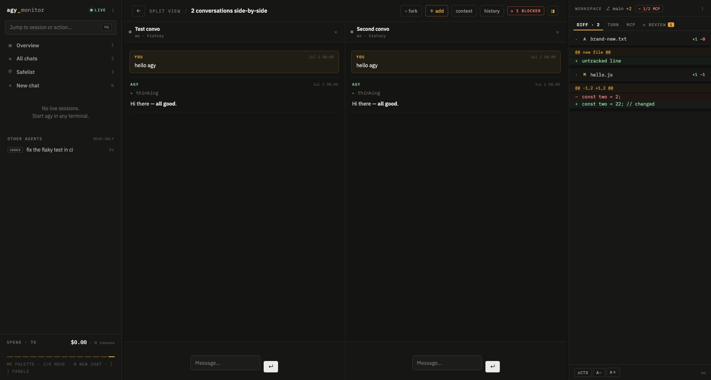
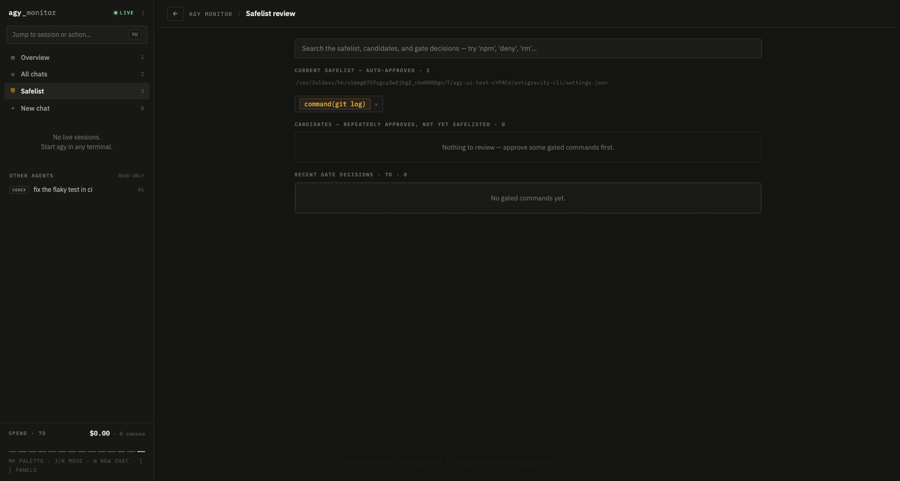
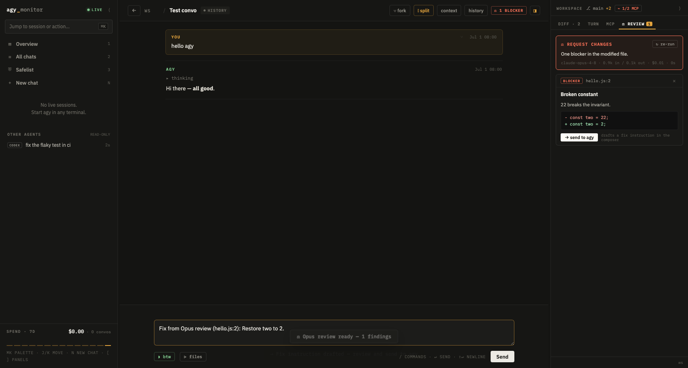

# agy-monitor

A local web console for Google's [Antigravity CLI](https://antigravity.google) (`agy`) — watch your agent sessions live, read full transcripts, and drive conversations from the browser.

[](https://github.com/kyleacmooney/agy-monitor/actions/workflows/ci.yml)



`agy-monitor` runs a small always-on server (`node server.js` → http://127.0.0.1:8719) and serves a single-page console over your local `agy` state. It has **zero runtime dependencies** — just Node 20+ and the standard library. Everything except the Claude-powered extras works with no cloud credentials at all: session monitoring, transcripts, the composer, cost estimates, workspace diffs, the MCP panel, and read-only views of your other coding agents are all driven from local files and `ps`/`lsof`.

## Features

- **Live session state** — busy / idle / waiting, sourced from a tiny observe-only hook `agy` runs on every lifecycle event. One card per live `agy` process.
- **Full transcripts** — user and agent messages, collapsible thinking, tool calls with results, and `write_to_file` rendered as a diff. Clickable file references open an in-app viewer.
- **Composer** — continue any conversation or start a new one from the browser; new turns stream back in. Forking and `/btw` side-questions branch a conversation without disturbing the original.
- **Command-approval safety gate** — UI-triggered runs route their shell commands through an LLM-backed gate. Safelisted commands auto-run; anything else pauses for a one-click Approve/Deny. Fails closed. A learned safelist proposes minimal, Claude-Code-style prefixes you can promote or demote.
- **Cost estimates** — per-conversation list-price estimates plus a global spend rollup, decoded dependency-free from `agy`'s own token-usage metadata.
- **Repeated prompts fold** — a script that drives `agy -p` on a loop (a commit-message helper, a judge, a health probe) would otherwise bury every hand-written chat. Conversations that open with the same prompt collapse into one group you can expand. Nothing is hidden from the counts, from search, or from the spend rollup — see `AGY_NOISE_MIN_CLUSTER`.
- **Workspace diffs** and an **MCP panel** that enumerates and probes the MCP servers `agy` can actually load.
- **Other agents, read-only** — surfaces local [Codex CLI](https://github.com/openai/codex) and VS Code Copilot chat sessions alongside your `agy` ones.
- **Fan-out** — run N parallel `agy` workers on one task, each in its own git worktree, then let a Claude judge rank or merge the results.
- **One-shot Opus review** — a single Claude Opus pass over a workspace's working-tree diff, returning structured, dismissable findings.

## Requirements

- **macOS.** Session detection uses `ps`/`lsof` and the daemon is a launchd LaunchAgent. The hook itself is portable POSIX shell.
- **Node.js >= 20.**
- **The `agy` CLI** installed and used at least once (so `~/.gemini/antigravity-cli` exists).
- **Claude credentials are optional** — only the Opus review, the fan-out judge, and `/btw` side-questions need them (see [Claude-powered features](#claude-powered-features)).

## Quickstart

```sh
git clone https://github.com/kyleacmooney/agy-monitor.git
cd agy-monitor
./install.sh            # runs the doctor and prints next steps
npm start               # → http://127.0.0.1:8719
```

Open http://127.0.0.1:8719. If the live-state hook isn't installed yet, the console shows a first-run setup screen with the same environment checks as the doctor and a one-click install.

`install.sh` also wires up the optional pieces — the background daemon, the `agy` hook, and the desktop app. The flags are combinable and always run in a fixed order:

```sh
./install.sh --daemon   # launchd background daemon
./install.sh --hook     # register the agy status hook
./install.sh --app      # build the "Agy Monitor" desktop app
./install.sh --all      # all of the above, then a final health check
```

You can run the checks anytime from the terminal:

```sh
npm run doctor          # node / agy binary / data dir / hook install / gate / Claude creds / server health
```

To register the live-state hook manually (it writes the hook's **absolute path** into `agy`'s config, so re-run it if you move the repo):

```sh
node install-hooks.js              # install
node install-hooks.js --status     # show what's installed
node install-hooks.js --uninstall  # remove (restores from backup)
```

All hook entries live under a single `agy-monitor` key, and the config is backed up before every write, so installing or removing never touches your other hooks.

## Run it in the background

Install as a launchd LaunchAgent so it starts at login and restarts on crash:

```sh
./install.sh --daemon      # or: daemon/install.sh directly
daemon/restart.sh          # restart onto the current code
daemon/uninstall.sh        # remove
```

Override the port or add a token by exporting them first (`PORT=…`, `AGY_MONITOR_TOKEN=…`, `AGY_MONITOR_SELF_UPDATE=1`). The agent's label is `com.<you>.agy-monitor` (override with `AGY_MONITOR_LABEL`) and logs go to `~/Library/Logs/agy-monitor.log`.

## Updating

On a machine that runs the daemon, pull the latest and restart in one step:

```sh
./update.sh                # git pull → re-point the plist → restart → health check
```

There are no runtime dependencies, so there's nothing to `npm install` for a normal
update. `update.sh` skips the pull automatically if the folder isn't a git checkout
(e.g. you refreshed it from a downloaded ZIP), so it still restarts onto the new code —
just refresh the folder first. State and config live in `~/.agy-monitor/`, outside the
repo, so replacing the folder never loses anything.

## Desktop app

```sh
./install.sh --app         # or: scripts/make-app.sh  (PORT=… to bake a non-default port)
```

This builds `Agy Monitor.app` into `~/Applications`. It gives you a Dock icon that opens the console as a chromeless Chrome/Edge/Brave app-mode window, reusing the daemon if installed or starting a detached server first (with a health check) if not. The repo path is baked into the app, so re-run it if you move the repo.

## Configuration

Every setting is an environment variable. You can also drop them in `~/.agy-monitor/config.json` — a flat `{ "ENV_NAME": "value" }` object read at startup for any key **not** already set in the environment (the environment always wins). Only `PORT`, `BIND_HOST`, and keys starting with `AGY_` or `ANTHROPIC_` are honored. `chmod 600` it if you put `ANTHROPIC_API_KEY` there.

### Core

| Variable | Default | Purpose |
|---|---|---|
| `PORT` | `8719` | Server port. |
| `BIND_HOST` | `127.0.0.1` | Bind address — keep it on loopback. |
| `AGY_MONITOR_TOKEN` | *(empty)* | Bearer token required on `/api`. Empty means open on loopback. |
| `AGY_MONITOR_ROOT` | `~/.agy-monitor` | State directory (status files, approvals, caches, config.json). |
| `AGY_CLI_HOME` | `~/.gemini/antigravity-cli` | `agy`'s data directory. |
| `AGY_GEMINI_HOME` | `~/.gemini` | `agy`'s config root (where `hooks.json` lives). |
| `AGY_MONITOR_LABEL` | `com.<you>.agy-monitor` | launchd label. |
| `AGY_MONITOR_EXTRA_ROOTS` | *(none)* | Extra workspace roots to scan for sessions. |
| `AGY_MONITOR_SELF_UPDATE` | *(off)* | Set `1` to enable the live "improve this app" self-update. Off by default. |
| `AGY_NOISE_MIN_CLUSTER` | `5` | Chats that open with the same prompt fold into one collapsible group at this count. `0` disables folding. |

### Claude transport

| Variable | Default | Purpose |
|---|---|---|
| `AGY_ANTHROPIC_PROVIDER` | `bedrock` | `bedrock` or `anthropic`. |
| `AGY_AWS_PROFILE` | `saml` | AWS SSO profile for the Bedrock provider. |
| `AGY_AWS_REGION` | `us-east-1` | AWS region for Bedrock. |
| `AGY_REVIEW_MODEL` | `anthropic.claude-opus-4-8` (bedrock) / `claude-opus-4-8` (anthropic) | Model id for review / fan-out judge — Bedrock ids carry the `anthropic.` prefix. |
| `ANTHROPIC_API_KEY` | *(none)* | API key for the `anthropic` provider. |
| `ANTHROPIC_AUTH_TOKEN` | *(none)* | Alternative auth token for the `anthropic` provider. |
| `ANTHROPIC_BASE_URL` | *(default)* | Override the `anthropic` API endpoint. |

### Safety gate

| Variable | Default | Purpose |
|---|---|---|
| `AGY_GATE_SETTINGS` | `agy`'s `settings.json` | Source of the `permissions.allow` safelist. |
| `AGY_GATE_AGY_BIN` | resolved `agy` | `agy` binary the gate/runs use. |
| `AGY_GATE_TIMEOUT_MS` | `480000` (8 min) | How long a pending approval blocks before it denies. |
| `AGY_GATE_CLASSIFIER` | *(internal)* | Recursion sentinel the gate sets on its own classifier children — not a user setting. |
| `AGY_GATE_CLASSIFIER_TIMEOUT_MS` | `45000` (45 s) | Hard timeout for a classifier call. |
| `AGY_GATE_CACHE_TTL_MS` | `604800000` (7 days) | TTL for cached `(command, cwd)` verdicts. |

### Safelist promoter

| Variable | Default | Purpose |
|---|---|---|
| `AGY_PROMOTER_WINDOW_DAYS` | `30` | Candidacy review window. |
| `AGY_PROMOTER_MIN_COUNT` | `5` | Minimum approvals before a prefix is a candidate. |
| `AGY_PROMOTER_MIN_CONVERSATIONS` | `2` | Minimum distinct conversations. |
| `AGY_PROMOTER_SNOOZE_MS` | `604800000` (7 days) | How long a snoozed suggestion stays hidden. |

### External agents

| Variable | Default | Purpose |
|---|---|---|
| `AGY_CODEX_ROOT` | `~/.codex/sessions` | Codex CLI session root. |
| `AGY_COPILOT_ROOT` | VS Code `workspaceStorage` | Copilot chat session root. |

## Remote access

Always bind to loopback. To reach the console from another device, front it with a secure tunnel rather than binding a public interface — [`tailscale serve`](https://tailscale.com/kb/1242/tailscale-serve) works well — and set `AGY_MONITOR_TOKEN` so the API requires a bearer token.

## Security model

- **Loopback-only by default.** The server binds `127.0.0.1`; remote exposure is an explicit tunnel-plus-token decision, never automatic.
- **Bearer token.** With `AGY_MONITOR_TOKEN` set, every `/api` call needs it (checked in constant time); `/api/health` stays open for probes.
- **Observe-only hook.** The live-state hook only reads the event payload and writes a status file — it always returns `allow` and never influences `agy`'s decisions.
- **The gate fails closed.** Any abnormal path — timeout, parse error, missing data — resolves to *manual approval*, never auto-allow. The classifier is sandboxed against recursion (it can never spawn a gated child of itself).
- **One-click approvals, human-gated safelist.** Nothing is added to your safelist automatically; the promoter only ever *suggests* minimal prefixes, and never a bare binary or a deny-class command.
- **Backups before writes.** Hook and settings changes back up the original file first.

## How live state works

`agy` fires hooks defined in `~/.gemini/config/hooks.json`. Each hook receives a JSON payload on stdin (`conversationId`, `workspacePaths`, `transcriptPath`, tool-call details, and idle/termination info on `Stop`). The monitor's hook maps each event to a state and writes it to a per-conversation status file the server reads:

| Event | State |
|---|---|
| `PreInvocation` | busy (thinking) |
| `PreToolUse` | busy (running a tool) |
| `PostToolUse` / `PostInvocation` | busy (working) |
| `Stop` (`fullyIdle`) | idle — your turn |
| `Notification` | waiting — needs attention |

The model is **one card per live `agy` process** (each terminal). `agy` runs one OS process per terminal but multiplexes conversations inside it and has no session start/end hook, so the process is the reliable unit: `ps` gives liveness, `lsof` the workspace. A conversation's state attaches to a process only when its hook event fired *after* that process started, so a stale conversation in the same folder can never mislabel a fresh session. The persistent idle / your-turn state is for interactive sessions; `agy -p` print sessions exit the moment they finish.

## Safety gate

UI-triggered runs launch with `AGY_MONITOR_GATED=1`, which routes their `run_command` tool calls through the `PreToolUse` hook into the gate. Commands matching `agy`'s `permissions.allow` safelist auto-run; an optional LLM classifier can auto-allow a provably-safe command at high confidence; everything else records a pending approval and blocks — pausing the `agy` turn — until you Approve or Deny from the console (or it times out and denies). Your real terminal sessions carry no gate env and are never gated.

The full design — pipeline, recursion-safety, prompt design, decision mapping, and the safelist promoter — is documented in [docs/safety-gate-design.md](docs/safety-gate-design.md).



## External agents

Beyond `agy`, the console surfaces other local coding agents **read-only** — it never writes to their files:

- **Codex CLI** — sessions under `~/.codex/sessions` (both the 2025 and 2026 transcript formats).
- **VS Code Copilot** — chat sessions from VS Code's `workspaceStorage`.

## Claude-powered features

The Opus review, the fan-out judge, and `/btw` side-questions talk to Claude over raw HTTP (no SDK). (The safety gate's classifier is *not* one of them — it runs on `agy` itself as a sandboxed sub-process and needs no extra credentials.) Two providers:

- **`bedrock`** (default) — Claude in Amazon Bedrock, SigV4-signed with credentials from an AWS SSO profile (`AGY_AWS_PROFILE`, default `saml`) resolved via `aws configure export-credentials`. Requires a prior `aws sso login`.
- **`anthropic`** — the first-party API, authenticated with `ANTHROPIC_API_KEY` (or `ANTHROPIC_AUTH_TOKEN`).



If you don't configure either, these three features are simply unavailable; everything else in the console still works.

## Development

```sh
npm test          # full suite: unit tests + Playwright end-to-end
npm run test:unit # unit tests only (parse / policy / gate / promoter / state)
```

The end-to-end tests drive the server and UI in hermetic test worlds — they point `AGY_MONITOR_ROOT` and `AGY_CLI_HOME` at fixture directories and never touch your real `agy` config. CI runs the same two steps on macOS (see [.github/workflows/ci.yml](.github/workflows/ci.yml)).

## License

[MIT](LICENSE) © 2026 Kyle Mooney
